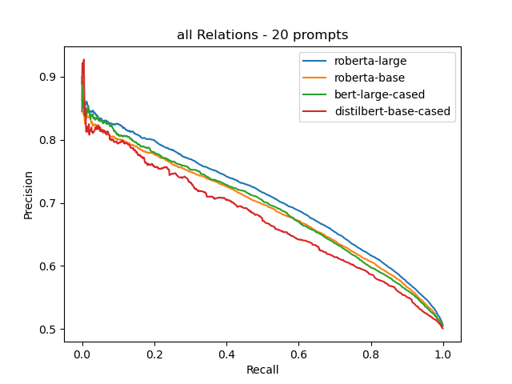
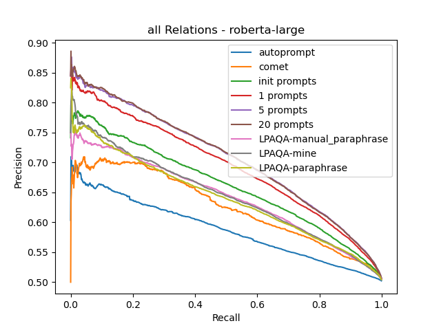

# knowledge-harvest-from-lms

## Results

### Precision-recall curves to evaluate scoring

* ckbc can be treated as the upper bound.
* overall, init prompt < 1 prompt < (slightly) multiple prompts




### Output entity tuples

Output entity tuples can be found in ```outputs/{rel_set}/{setting}/summary.txt```, like [outputs/conceptnet/1000tuples_20prompts_5seeds_maxsubwords2_maxrepeat5_temp1.0/summary.txt](outputs/conceptnet/1000tuples_20prompts_5seeds_maxsubwords2_maxrepeat5_temp1.0/summary.txt)

### CKBC scores of output entity tuples

CKBC score curves can be found [here](results/curves_outputs_ckbc).

in most of relations: init prompt < 1 prompt < 20 prompts

scores (first 100/1000 entity tuples):
``` 
+------------------+--------------+---------------+-----------------------+-----------------------+-----------------------+
|    Relations     | init prompts | best 1 prompt | all prompts (temp=1.) | all prompts (temp=2.) | all prompts (temp=4.) |
+------------------+--------------+---------------+-----------------------+-----------------------+-----------------------+
|    AtLocation    |    0.1459    |     0.3444    |         0.5187        |         0.6936        |         0.6938        |
|    CapableOf     |    0.2211    |     0.5761    |         0.3380        |         0.3026        |         0.2192        |
|      Causes      |    0.2487    |     0.1451    |         0.2312        |         0.3242        |         0.3121        |
|   CausesDesire   |    0.1579    |     0.0921    |         0.2801        |         0.4470        |         0.4833        |
|    CreatedBy     |    0.3051    |     0.4926    |         0.5233        |         0.6080        |         0.6151        |
|    DefinedAs     |    0.5031    |     0.7217    |         0.5250        |         0.5107        |         0.5513        |
|     Desires      |    0.2858    |     0.2126    |         0.2784        |         0.3178        |         0.3519        |
|       HasA       |    0.3410    |     0.4460    |         0.3760        |         0.4179        |         0.4766        |
| HasFirstSubevent |    0.1197    |     0.4098    |         0.7057        |         0.6262        |         0.4627        |
| HasLastSubevent  |    0.0429    |     0.4427    |         0.5717        |         0.5381        |         0.5656        |
| HasPrerequisite  |    0.5762    |     0.5711    |         0.6874        |         0.6611        |         0.6597        |
|   HasProperty    |    0.2783    |     0.3644    |         0.4663        |         0.5395        |         0.5642        |
|   HasSubEvent    |    0.1644    |     0.1196    |         0.0834        |         0.6019        |         0.5596        |
|       IsA        |    0.4940    |     0.6873    |         0.5597        |         0.5995        |         0.5817        |
|      MadeOf      |    0.3062    |     0.3880    |         0.5040        |         0.3811        |         0.3831        |
| MotivatedByGoal  |    0.1934    |     0.5296    |         0.6033        |         0.6184        |         0.6075        |
|      PartOf      |    0.3819    |     0.0873    |         0.2959        |         0.3932        |         0.3970        |
|  ReceivesAction  |    0.0791    |     0.1239    |         0.1170        |         0.1378        |         0.1403        |
|     SymbolOf     |    0.2764    |     0.2664    |         0.4443        |         0.4673        |         0.4212        |
|     UsedFor      |    0.2607    |     0.3431    |         0.3428        |         0.2841        |         0.2905        |
|      Total       |    0.2691    |     0.3682    |         0.4226        |         0.4735        |         0.4668        |
+------------------+--------------+---------------+-----------------------+-----------------------+-----------------------+
```

```
+------------------+-------------------------------------+------------------------------------+----------------------------------+-------------------------------------+------------------------------------+
|    Relations     | roberta-large all prompts (temp=2.) | roberta-base all prompts (temp=2.) | bert-large all prompts (temp=2.) | roberta-large all prompts (temp=1.) | roberta-base all prompts (temp=1.) |
+------------------+-------------------------------------+------------------------------------+----------------------------------+-------------------------------------+------------------------------------+
|    AtLocation    |                0.6702               |               0.6783               |              0.6183              |                0.5098               |               0.5831               |
|    CapableOf     |                0.2275               |               0.2652               |              0.2729              |                0.2665               |               0.2844               |
|      Causes      |                0.2589               |               0.2293               |              0.1829              |                0.2160               |               0.1294               |
|   CausesDesire   |                0.5030               |               0.4580               |              0.4164              |                0.4352               |               0.3899               |
|    CreatedBy     |                0.6269               |               0.6156               |              0.4727              |                0.5603               |               0.4125               |
|    DefinedAs     |                0.5160               |               0.6061               |              0.6325              |                0.5587               |               0.6153               |
|     Desires      |                0.3441               |               0.3747               |              0.2886              |                0.3521               |               0.4067               |
|       HasA       |                0.4112               |               0.2987               |              0.3919              |                0.3171               |               0.2649               |
| HasFirstSubevent |                0.6952               |               0.7576               |              0.7357              |                0.6735               |               0.6997               |
| HasLastSubevent  |                0.5713               |               0.5378               |              0.7249              |                0.4564               |               0.4757               |
| HasPrerequisite  |                0.6498               |               0.6627               |              0.5927              |                0.6736               |               0.6516               |
|   HasProperty    |                0.4081               |               0.4624               |              0.5225              |                  //                 |               0.5111               |
|   HasSubEvent    |                0.5788               |               0.5512               |              0.7923              |                0.1719               |               0.2316               |
|       IsA        |                0.5398               |               0.6092               |              0.5896              |                0.5319               |               0.5305               |
|      MadeOf      |                0.4589               |               0.3540               |              0.4421              |                0.4180               |               0.4244               |
| MotivatedByGoal  |                0.5845               |               0.6681               |              0.7159              |                0.5925               |               0.6119               |
|      PartOf      |                0.3705               |               0.3436               |              0.3372              |                  //                 |               0.3323               |
|  ReceivesAction  |                0.1698               |               0.1668               |              0.1265              |                0.1694               |               0.1509               |
|     SymbolOf     |                0.3448               |               0.3597               |              0.3753              |                0.3008               |               0.3658               |
|     UsedFor      |                0.2522               |               0.3100               |                //                |                0.2255               |               0.3652               |
|      Total       |                0.4591               |               0.4654               |              0.4858              |                0.4127               |               0.4218               |
+------------------+-------------------------------------+------------------------------------+----------------------------------+-------------------------------------+------------------------------------+
```

