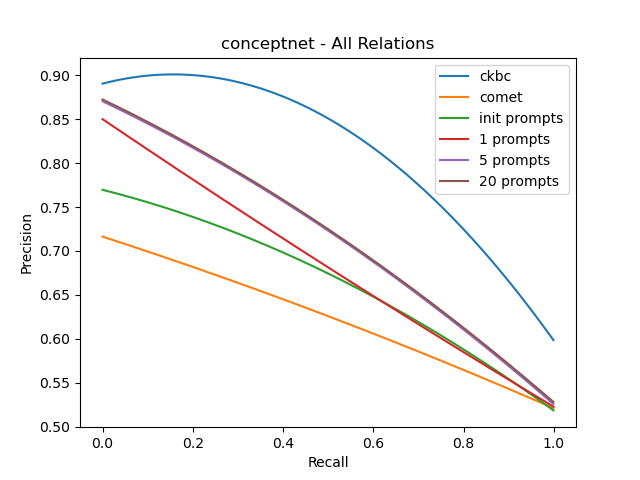
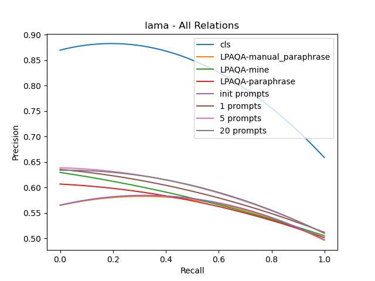

# knowledge-harvest-from-lms

## Results

### Precision-recall curves to evaluate scoring

* ckbc can be treated as the upper bound.
* overall, init prompt < 1 prompt < (slightly) multiple prompts




### Output entity tuples

Output entity tuples can be found in ```outputs/{rel_set}/{setting}/summary.txt```, like [outputs/conceptnet/1000tuples_20prompts_5seeds_maxsubwords2_maxrepeat5_temp1.0/summary.txt](outputs/conceptnet/1000tuples_20prompts_5seeds_maxsubwords2_maxrepeat5_temp1.0/summary.txt)

### CKBC scores of output entity tuples

CKBC score curves can be found [here](results/curves_outputs_ckbc).

in most of relations: init prompt < 1 prompt < 20 prompts

scores (first 100/1000 entity tuples):
``` 
+------------------+--------------+---------------+-------------+
|    Relations     | init prompts | best 1 prompt | all prompts |
+------------------+--------------+---------------+-------------+
|    AtLocation    |    0.1459    |     0.3444    |    0.5187   |
|    CapableOf     |    0.2211    |     0.5761    |    0.3380   |
|      Causes      |    0.2487    |     0.1451    |    0.2312   |
|   CausesDesire   |    0.1579    |     0.0921    |    0.2801   |
|    CreatedBy     |    0.3051    |     0.4926    |    0.5233   |
|    DefinedAs     |    0.5031    |     0.7217    |    0.5250   |
|     Desires      |    0.2858    |     0.2126    |    0.2784   |
|       HasA       |    0.3410    |     0.4460    |    0.3760   |
| HasFirstSubevent |    0.1197    |     0.4098    |    0.7057   |
| HasLastSubevent  |    0.0429    |     0.4427    |    0.5717   |
| HasPrerequisite  |    0.5762    |     0.5711    |    0.6874   |
|   HasProperty    |    0.2783    |     0.3644    |    0.4663   |
|   HasSubEvent    |    0.1644    |     0.1196    |    0.0834   |
|       IsA        |    0.4940    |     0.6873    |    0.5597   |
|      MadeOf      |    0.3062    |     0.3880    |    0.5040   |
| MotivatedByGoal  |    0.1934    |     0.5296    |    0.6033   |
|      PartOf      |    0.3819    |     0.0873    |    0.2959   |
|  ReceivesAction  |    0.0791    |     0.1239    |    0.1170   |
|     SymbolOf     |    0.2764    |     0.2664    |    0.4443   |
|     UsedFor      |    0.2607    |     0.3431    |    0.3428   |
|      Total       |    0.2691    |     0.3682    |    0.4226   |
+------------------+--------------+---------------+-------------+

```

